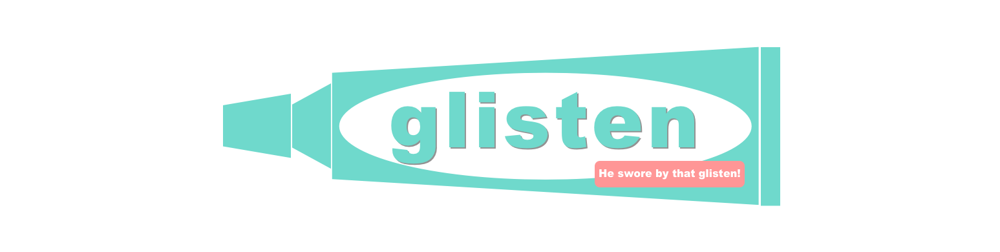
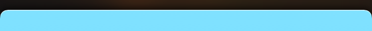

# Overview
[](http://cocoapods.org/?q=Glass)
[](https://github.com/comyarzaheri/Glisten)
[]()
[](https://github.com/comyarzaheri/Glisten/blob/master/LICENSE)

Glisten is a simple UIView extension that allows you to add a highlight on top of views. The recommended use case for Glisten is when you're attempting to add a subtle, white highlight to a view with rounded corners and you're not satisfied with just a straight line.

# How does it look?

The effect is subtle, but notice how the highlight partially follows the rounded corners of our view:



The line width and color are configurable, so you can make it more or less dramatic. Glisten also works for straight-edged views though that use case isn't particularly interesting.

# Usage 

##### CocoaPods

Add the following to your Podfile:

```ruby
pod 'Glisten'
```
##### Carthage 

Add the following to your Cartfile:

```ruby
github "comyarzaheri/Glisten" "master"
```

### Using Glisten

```swift
import Glisten

// Set the default glisten
view.glisten() 

// Or use the following to configure the highlight more precisely:
view.glisten(cornerRadius: 8.0, lineWidth: 2.0, color: UIColor.whiteColor())
```

# Requirements

* iOS 8.0 or higher

# License 

Glisten is available under the [MIT License](LICENSE).

# Contributors

* [@comyarzaheri](https://github.com/comyarzaheri)
